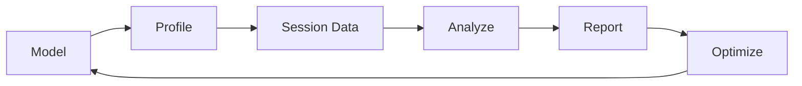

# User Guide Overview

Welcome to the AMD AI Compute Observatory User Guide. This guide provides comprehensive documentation for all AACO features.

## What is AACO?

AMD AI Compute Observatory (AACO-Ω∞) is a **deterministic, self-calibrating, cross-layer AI performance laboratory** that provides:

- **Scientific Measurement**: Reproducible, statistically rigorous profiling
- **Root Cause Analysis**: Bayesian inference for performance bottlenecks
- **Automated Governance**: Statistical drift detection and regression alerts
- **Hardware Optimization**: Ceiling analysis with hardware digital twin

## Core Concepts

### Sessions

A **session** is a complete profiling run that captures:

- Execution times (warmup + measured iterations)
- Hardware counters (GPU, memory, power)
- Kernel traces (timeline, occupancy)
- System metrics (CPU, memory, thermals)

```python
from aaco import Observatory

obs = Observatory()
session = obs.profile(model="model.onnx")

# Session contains all collected data
print(session.summary())
```

### Analysis

**Analysis** transforms raw session data into actionable insights:

- Statistical aggregation (mean, median, percentiles)
- Outlier detection and filtering
- Bottleneck classification
- Root cause inference

```python
analysis = obs.analyze(session)
print(analysis.bottleneck)
print(analysis.root_cause())
```

### Reports

**Reports** present analysis results in various formats:

- HTML interactive dashboards
- JSON for programmatic access
- Markdown for documentation
- PDF for formal reports

```python
obs.report(session, format="html", output="report.html")
```

## Workflow



### 1. Profile

Run profiling to collect performance data:

```bash
aaco profile --model model.onnx --output session/
```

### 2. Analyze

Analyze the collected data:

```bash
aaco analyze --session session/ --output analysis.json
```

### 3. Report

Generate human-readable reports:

```bash
aaco report --session session/ --format html
```

### 4. Compare

Compare against baselines:

```bash
aaco compare --baseline baseline/ --current session/
```

## Guide Sections

| Section | Description |
|---------|-------------|
| [Laboratory Mode](laboratory-mode.md) | Deterministic profiling setup |
| [Profiling](profiling.md) | Data collection options |
| [Analysis](analysis.md) | Understanding metrics |
| [Dashboard](dashboard.md) | Interactive visualization |

## Next Steps

- [Laboratory Mode](laboratory-mode.md) - Set up deterministic profiling
- [Profiling Guide](profiling.md) - Learn profiling options
- [Examples](../examples/basic.md) - See practical examples
